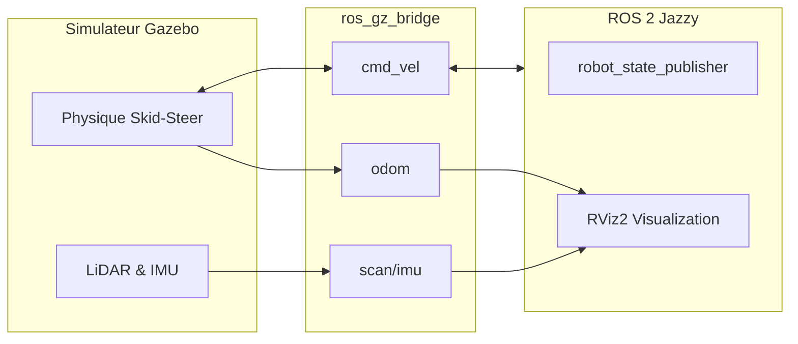

# 📘 Documentation Officielle : Architecture et Simulation AMR (Husky A300 Style)

Ce document décrit en détail l'architecture, le fonctionnement technique, et la méthodologie adoptée pour le développement de notre système de simulation d'une flotte de robots autonomes (AMR).

---

## 🛠️ Historique des Modifications et Choix Techniques

Le projet a évolué depuis un modèle basique vers une architecture robuste, industrielle et académique. Voici les étapes majeures du développement :

### 1. Refonte Architecturale et Style "Husky A300" (Nouveau !)
- **Changement de modèle** : Le robot est passé d'un "diff-drive" classique à une architecture **Skid-Steer (4 roues motrices type tout-terrain)**, s'inspirant fortement du design du **Husky A300** d'Clearpath Robotics.
- **Robot Industriel pour Entrepôt** : Le design a été revu avec un châssis jaune robuste, de grandes roues pneumatiques, un plateau supérieur gris foncé, et des pare-chocs avant/arrière.
- **Touche Personnelle Académique (UDM)** : Ajout de rails latéraux distinctifs bleus (aux couleurs de l'UDM) pour marquer l'appartenance académique du projet tout en gardant une esthétique professionnelle.
- **Capteurs Uniques** : La configuration a été épurée pour ne contenir qu'un mât central (Sensor Mast) équipé d'un **LiDAR 2D (gpu_lidar)** et d'une **Centrale Inertielle (IMU)** logée dans le châssis.

### 2. Configuration Multi-Robots (Flotte)
- **Namespacing Strict** : Isolation complète de chaque instance de robot (`/robot1`, `/robot2`, etc.) via injection d'arguments Xacro.
- **Gestion des Transformations (TF)** : Implémentation du `frame_prefix` pour garantir l'indépendance de l'arbre TF de chaque robot.

### 3. Synchronisation Simulation-ROS 2 (Bridge)
- **ros_gz_bridge** : Mise en place et optimisation du pont entre Gazebo Harmonic et ROS 2 Jazzy. Synchronisation bidirectionnelle des commandes de vélocité (`cmd_vel`), odométrie (`odom`), et capteurs (`scan`, `imu`).
- **LiDAR brut** : Le scan Gazebo `/scan` est consommé directement par ROS 2 et Cartographer, sans filtre logiciel intermédiaire.

---

## 🏗️ Architecture et Flux de Données

Le système repose sur la communication entre **Gazebo Harmonic** (le moteur physique) et **ROS 2 Jazzy** (le cerveau du robot).

---

## 📦 Structure des Fichiers URDF (Xacro)

L'URDF est modulaire, permettant une gestion simplifiée du robot industriel :

1.  **`robot_core.xacro`** : Définit la géométrie visuelle (Châssis Husky, Roues, Rails UDM).
2.  **`inertial_macros.xacro`** : Formules mathématiques pour l'inertie réaliste.
3.  **`lidar.xacro` & `imu.xacro`** : Définition des capteurs sur le mât central et dans le châssis.
4.  **`gazebo_control.xacro`** : Configuration cinématique (gz-sim-diff-drive-system en mode skid-steer).

---

## 🚀 Résumé des Commandes d'Exécution

| Objectif | Commande |
|----------|----------|
| **Tout compiler** | `colcon build --symlink-install` |
| **Simuler 1 robot** | `ros2 launch industry_robot_sim sim.launch.py` |
| **Simuler 4 robots** | `ros2 launch industry_robot_multi_sim multi_sim.launch.py` |
| **Contrôler (clavier)** | `ros2 run teleop_twist_keyboard teleop_twist_keyboard --ros-args -r cmd_vel:=/robot1/cmd_vel` |

---

## 🏁 Conclusion

Cette architecture industrielle (Skid-Steer Husky A300) combinée à notre méthodologie modulaire multi-packages fournit une base solide pour l'expérimentation d'algorithmes de navigation complexe, SLAM multi-agents, et l'intégration AIoT pour les entrepôts du futur.
