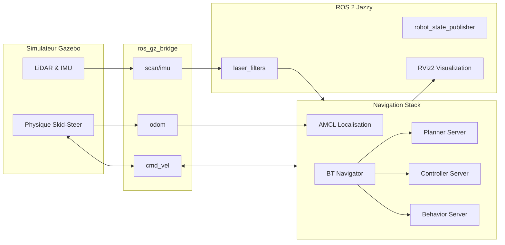

# 📘 Documentation Officielle : Architecture et Simulation AMR (Husky A300 Style)

Ce document décrit en détail l'architecture, le fonctionnement technique, et la méthodologie adoptée pour le développement de notre système de simulation d'une flotte de robots autonomes (AMR).

---

## 🛠️ Historique des Modifications et Choix Techniques

Le projet a évolué depuis un modèle basique vers une architecture robuste, industrielle et académique. Voici les étapes majeures du développement :

### 1. Refonte Architecturale et Style "Husky A300" (Nouveau !)
- **Changement de modèle** : Le robot est passé d'un "diff-drive" classique à une architecture **Skid-Steer (4 roues motrices type tout-terrain)**, s'inspirant fortement du design du **Husky A300** d'Clearpath Robotics.
- **Robot Industriel pour Entrepôt** : Le design a été revu avec un châssis robuste, de grandes roues pneumatiques, un plateau supérieur gris foncé, et des pare-chocs avant/arrière.
- **Touche Personnelle Académique (UDM)** : Ajout de rails latéraux distinctifs bleus (aux couleurs de l'UDM) pour marquer l'appartenance académique du projet tout en gardant une esthétique professionnelle.
- **Capteurs Uniques** : La configuration a été épurée pour ne contenir qu'un mât central (Sensor Mast) équipé d'un **LiDAR 2D (gpu_lidar)** et d'une **Centrale Inertielle (IMU)** logée dans le châssis.

### 2. Configuration Multi-Robots (Flotte)
- **Namespacing Strict** : Isolation complète de chaque instance de robot (`/robot1`, `/robot2`, etc.) via injection d'arguments Xacro.
- **Gestion des Transformations (TF)** : Implémentation du `frame_prefix` pour garantir l'indépendance de l'arbre TF de chaque robot.

### 3. Synchronisation Simulation-ROS 2 (Bridge)
- **ros_gz_bridge** : Mise en place et optimisation du pont entre Gazebo Harmonic et ROS 2 Jazzy. Synchronisation bidirectionnelle des commandes de vélocité (`cmd_vel`), odométrie (`odom`), et capteurs (`scan`, `imu`).
- **Filtrage Sensoriel** : Configuration de `laser_filters` pour éviter que le LiDAR ne détecte des pièces du robot lui-même (Self-Detection).

### 4. SLAM Cartographer
- **Cartographie 2D temps réel** : Intégration de Google Cartographer, adapté depuis TurtleBot3 Cartographer.
- **Paramètres spécialisés** : Portée LiDAR étendue (10m), seuil de fermeture de boucle relevé (0.65) pour l'environnement entrepôt.
- **Sauvegarde de carte** : Génération de `warehouse.pgm`/`warehouse.yaml` utilisés ensuite par Nav2.

### 5. Navigation Autonome Nav2
- **Architecture TurtleBot3** : Adoption de l'approche standard `nav2_bringup` pour la navigation autonome, identique à TurtleBot3 Navigation.
- **Deux fichiers launch** :
  - `nav.launch.py` — launch complet du projet (Gazebo + Nav2 + RViz), arguments `use_sim`, `use_rviz`, `slam`, `map`
  - `navigation2.launch.py` — wrapper du package `turtlebot3_navigation2`, interface identique à `ros2 launch turtlebot3_navigation2 navigation2.launch.py map:=...`
- **Stack complète** : AMCL (localisation), NavfnPlanner (planification globale), DWB (contrôle local), Behavior Server (récupération).
- **Adaptations clés** :
  - Footprint rectangulaire `1.06 × 0.86m` (châssis + pare-chocs + roues) au lieu du simple rayon circulaire de TurtleBot3.
  - Limites cinématiques calées sur `gazebo_control.xacro` : 1.0 m/s linéaire, 2.0 rad/s angulaire, accélérations 1.5 m/s² et 3.0 rad/s².
  - Topic `/scan_filtered` (pas `/scan`) pour éviter la self-detection dans les costmaps.
  - Inflation radius 0.75m (adapté au footprint du robot).
- **Bug corrigé** : `slam.launch.py` transmettait `use_sim_time: True` hardcodé aux nodes Cartographer/RViz au lieu d'utiliser l'argument du launch — corrigé pour fonctionner correctement sur robot réel (`use_sim_time:=false`).

---

## 🏗️ Architecture et Flux de Données

Le système repose sur la communication entre **Gazebo Harmonic** (le moteur physique) et **ROS 2 Jazzy** (le cerveau du robot).



---

## 📦 Structure des Fichiers URDF (Xacro)

L'URDF est modulaire, permettant une gestion simplifiée du robot industriel :

1.  **`robot_core.xacro`** : Définit la géométrie visuelle (Châssis, Roues, Rack).
2.  **`inertial_macros.xacro`** : Formules mathématiques pour l'inertie réaliste.
3.  **`lidar.xacro` & `imu.xacro`** : Définition des capteurs sur le mât central et dans le châssis.
4.  **`gazebo_control.xacro`** : Configuration cinématique (gz-sim-diff-drive-system en mode skid-steer).

---

## 🗺️ Pipeline Cartographie → Navigation

Le flux de travail complet pour passer de l'exploration à la navigation autonome :

```
  ┌──────────────────────────────────────────────────────────────────────┐
  │  ÉTAPE 1 : SLAM (Exploration)                                      │
  │  ros2 launch industry_robot_sim sim.launch.py                      │
  │  ros2 launch industry_robot_slam slam.launch.py                    │
  │  ros2 run teleop_twist_keyboard teleop_twist_keyboard              │
  │  → Explorer tout l'entrepôt avec le clavier                        │
  │  → Sauvegarder : ros2 run nav2_map_server map_saver_cli -f ...     │
  └──────────────────────┬───────────────────────────────────────────────┘
                         │  warehouse.pgm + warehouse.yaml
                         ▼
  ┌──────────────────────────────────────────────────────────────────────┐
  │  ÉTAPE 2 : NAVIGATION (Exploitation)                               │
  │                                                                    │
  │  Option A (projet complet) :                                       │
  │  ros2 launch industry_robot_navigation nav.launch.py               │
  │                                                                    │
  │  Option B (interface TurtleBot3) :                                 │
  │  ros2 launch industry_robot_navigation navigation2.launch.py \     │
  │    map:=$HOME/map.yaml                                             │
  │                                                                    │
  │  → AMCL charge la carte et localise le robot                       │
  │  → "2D Pose Estimate" dans RViz pour la position initiale          │
  │  → "Nav2 Goal" dans RViz pour envoyer des objectifs                │
  │  → Le robot planifie, évite les obstacles, et atteint l'objectif   │
  └──────────────────────────────────────────────────────────────────────┘
```

---

## 🔧 Cohérence des Paramètres Cinématiques

Les paramètres cinématiques sont synchronisés entre tous les fichiers de configuration :

| Paramètre | `gazebo_control.xacro` | `nav2_params.yaml` (DWB) | `nav2_params.yaml` (Velocity Smoother) |
|-----------|----------------------|--------------------------|---------------------------------------|
| `max_vel_x` | 1.0 m/s | 1.0 m/s | 1.0 m/s |
| `min_vel_x` | -1.0 m/s | 0.0 m/s (marche avant) | -1.0 m/s |
| `max_vel_theta` | 2.0 rad/s | 2.0 rad/s | 2.0 rad/s |
| `max_accel_x` | 1.5 m/s² | 1.5 m/s² | 1.5 m/s² |
| `max_accel_theta` | 3.0 rad/s² | 3.0 rad/s² | 3.0 rad/s² |
| `wheel_separation` | 0.74 m | — | — |
| `wheel_radius` | 0.165 m | — | — |

---

## 🚀 Résumé des Commandes d'Exécution

| Objectif | Commande |
|----------|----------|
| **Tout compiler** | `colcon build --symlink-install` |
| **Simuler 1 robot** | `ros2 launch industry_robot_sim sim.launch.py` |
| **Simuler 4 robots** | `ros2 launch industry_robot_multi_sim multi_sim.launch.py` |
| **SLAM** | `ros2 launch industry_robot_slam slam.launch.py` |
| **Navigation (projet)** | `ros2 launch industry_robot_navigation nav.launch.py` |
| **Navigation (style TurtleBot3)** | `ros2 launch industry_robot_navigation navigation2.launch.py map:=$HOME/map.yaml` |
| **Navigation + SLAM simultané** | `ros2 launch industry_robot_navigation nav.launch.py slam:=true` |
| **Robot réel** | `ros2 launch industry_robot_navigation navigation2.launch.py use_sim_time:=false map:=$HOME/map.yaml` |
| **Contrôler (clavier)** | `ros2 run teleop_twist_keyboard teleop_twist_keyboard` |
| **Sauvegarder carte** | `ros2 run nav2_map_server map_saver_cli -f <chemin>/warehouse` |

---

## 🏁 Conclusion

Cette architecture industrielle (Skid-Steer Husky A300) combinée à notre méthodologie modulaire multi-packages fournit une base solide pour :
- La **cartographie SLAM** d'environnements industriels complexes
- La **navigation autonome Nav2** avec évitement d'obstacles
- L'**expérimentation multi-agents** pour la coordination de flotte
- L'intégration AIoT pour les entrepôts du futur
