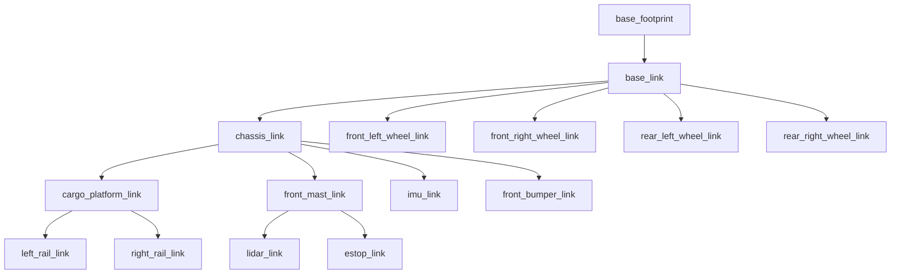

# Package ROS 2 `industry_robot` — Walkthrough complet

## Vue d'ensemble

Package ROS 2 Jazzy complet pour un robot mobile autonome (AMR), simulé sous Gazebo Harmonic. Design très fortement inspiré du robot industriel Effidence EffiBOT (4 grandes roues motrices, large plateau cargo, piliers robustes).

---

## Structure finale du package

```
industry_robot/
├── CMakeLists.txt                      # Build system avec install()
├── package.xml                         # Manifeste avec toutes les dépendances
├── urdf/
│   ├── warehouse_bot.urdf.xacro        # Fichier principal (inclusions)
│   ├── inertial_macros.xacro           # Macros d'inertie (box, cylinder, sphere)
│   ├── robot_core.xacro                # Corps du robot (châssis, 4 roues, plateau...)
│   ├── lidar.xacro                     # Capteur LiDAR 2D (gpu_lidar)
│   ├── imu.xacro                       # Centrale inertielle
│   └── gazebo_control.xacro            # Plugins DiffDrive (4 roues) + JointStatePublisher
├── launch/
│   ├── sim.launch.py                   # Simulation monde vide
│   └── display.launch.py              # Visualisation URDF seule (RViz)
├── config/
│   └── bridge.yaml                     # Mapping topics Gazebo ↔ ROS 2
└── rviz/
    └── view_robot.rviz                # Config RViz (robot, TF, scan, odom)
```

---

## Corrections et améliorations apportées

### Bugs corrigés et ajustements d'échelle

| Problème | Avant | Après |
|----------|-------|-------|
| Nom du package dans les launch files | `warehouse_bot` | `industry_robot` |
| package.xml manquait des dépendances | `urdf`, `xacro` seulement | + `ros_gz_sim`, `ros_gz_bridge`, `rviz2`, etc. |
| Taille du châssis | 0.35×0.30×0.12 m | **1.00×0.55×0.30 m** (échelle réelle) |
| Configuration des roues | 2 roues + 1 caster | **4 roues** (skid-steer) |
| Rayon des roues | r=0.065 m | **r=0.125 m** |
| Masse du châssis | 3.0 kg | **40.0 kg** (robot industriel lourd) |
| base_joint z=0 (robot dans le sol) | z=0 fixe | **z=wheel_radius** (xacro property) |
| Spawn z=0.15 (robot flottant) | z=0.15 | **z=0.0** |
| Wheel separation | 0.33 m | **0.63 m** |
| RViz Fixed Frame = base_footprint | Pas d'odom | **odom** (pour simulation) |

### Améliorations esthétiques (style EffiBOT)

| Élément ajouté | Description |
|----------------|-------------|
| **4 grandes roues** | Traction sur 4 roues, aspect massif |
| **4 piliers de support** | Montants robustes reliant châssis → plateau cargo |
| **Plateau cargo** | Grand plateau blanc au-dessus du châssis |
| **Rails latéraux bleus** | Garde-corps décoratifs sur le plateau |
| **Pare-chocs avant** | Barre de protection industrielle à l'avant |
| **Phares LED** | 2 lumières jaunes sur le mât avant |
| **Voyant LED status** | Indicateur vert d'opération sur le mât |
| **Bouton E-Stop** | Arrêt d'urgence rouge (visuel décoratif) |

---

## Hiérarchie TF



---

## Budget des masses (~65 kg)

| Composant | Masse (kg) |
|-----------|------------|
| Châssis | 40.00 |
| Plateau cargo | 5.00 |
| 4 Roues (4×3.0) | 12.00 |
| Mât avant | 2.00 |
| LiDAR | 0.12 |
| Pare-chocs | 1.00 |
| 4 piliers (4×0.2) | 0.80 |
| 2 rails (2×0.5) | 1.00 |
| IMU | 0.02 |
| **Total** | **~61.94 kg** |

---

## Topics bridgés (Gazebo ↔ ROS 2)

| Topic | Type ROS 2 | Direction |
|-------|-----------|-----------|
| `/cmd_vel` | `Twist` | ROS → GZ |
| `/odom` | `Odometry` | GZ → ROS |
| `/tf` | `TFMessage` | GZ → ROS |
| `/joint_states` | `JointState` | GZ → ROS |
| `/scan` | `LaserScan` | GZ → ROS |
| `/imu` | `Imu` | GZ → ROS |
| `/clock` | `Clock` | GZ → ROS |
