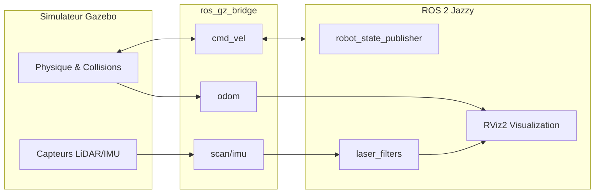

# 📘 Guide Détaillé : Fonctionnement et Méthodologie

Ce document explique en détail le fonctionnement technique, le flux de données et la méthodologie adoptée pour le développement de ce système de simulation.

---

## 🛠️ Méthodologie de Développement

La conception de ce projet a suivi une approche rigoureuse en 5 phases pour garantir un comportement physique réaliste et une architecture logicielle évolutive.

### Phase 1 : Modélisation Physique et Visuelle (URDF/Xacro)
- **Mise à l'échelle réelle** : Le robot a été conçu aux dimensions réelles d'un AMR industriel (100x55 cm).
- **Précision Inertielle** : Chaque composant utilise des macros de calcul d'inertie. Une mauvaise inertie causerait des comportements erratiques (robot qui tremble ou s'envole).
- **Modularité** : Utilisation de Xacro pour séparer le châssis, les roues et les capteurs, permettant de modifier un élément sans impacter les autres.

### Phase 2 : Configuration du Contrôle (Plugins Gazebo)
- **Plugin DiffDrive** : Configuration des paramètres cinématiques (séparation des roues, rayon) pour correspondre exactement au modèle physique.
- **Frottements (Friction)** : Ajustement des coefficients `mu1/mu2` des roues dans Gazebo pour permettre une traction efficace sans glissement excessif sur le sol de l'entrepôt.

### Phase 3 : Communication et Bridge
- **Standardisation des Topics** : Utilisation de types ROS 2 standards (`geometry_msgs`, `sensor_msgs`) pour assurer la compatibilité avec Nav2 ou Cartographer.
- **Optimisation du Bridge** : Configuration fine du `ros_gz_bridge` pour minimiser la latence des données LiDAR et IMU.

### Phase 4 : Stratégie Multi-Robots
- **Namespacing Strict** : Chaque instance de robot est isolée. La méthodologie repose sur l'injection dynamique du namespace dans l'URDF via des arguments Xacro.
- **Gestion des TF** : Utilisation de `frame_prefix` dans `robot_state_publisher` pour que chaque robot ait son propre arbre de transformations (ex: `robot1/base_link` -> `robot1/odom`).

### Organisation des Packages (Architecture ROS 2)
Le projet suit une organisation multi-packages pour séparer les responsabilités :
1.  **`_description`** : Les fichiers sources immuables du robot (URDF).
2.  **`_sim`** : Les fichiers d'orchestration pour un déploiement standard.
3.  **`_multi_sim`** : La couche d'abstraction pour la gestion de flotte.

---

---

## 🏗️ Architecture et Flux de Données

Le système repose sur la communication entre **Gazebo Harmonic** (le moteur physique) et **ROS 2 Jazzy** (le cerveau du robot) via un pont nommé `ros_gz_bridge`.

### Schéma du flux :

---

## 2. Structure Modulaire de l'URDF (Xacro)

L'URDF n'est pas un fichier unique, mais un assemblage de modules Xacro situés dans `industry_robot_description/urdf/` :

1.  **`robot_core.xacro`** : Définit la géométrie visuelle et de collision (châssis, roues, plateau).
2.  **`inertial_macros.xacro`** : Contient les formules mathématiques pour calculer l'inertie (indispensable pour que le robot ne s'envole pas ou ne s'enfonce pas).
3.  **`lidar.xacro` & `imu.xacro`** : Ajoutent les capteurs virtuels au modèle avec leurs paramètres (portée, fréquence).
4.  **`gazebo_control.xacro`** : Configure les plugins Gazebo (`diff_drive`) qui simulent les moteurs des roues et publient l'odométrie.

---

## 3. Logique Multi-Robots et Namespacing

C'est la partie la plus complexe du projet. Pour faire rouler 4 robots sans qu'ils ne se confondent, nous utilisons des **Namespaces** (`/robot1`, `/robot2`, etc.).

### Comment ça marche ?
-   **URDF Dynamique** : Le fichier `warehouse_bot.urdf.xacro` reçoit un argument `namespace`. Cela permet de préfixer les noms des liens (ex: `robot1/base_link`) pour que les transformations (TF) soient uniques.
-   **Isolation des Topics** : Chaque robot possède son propre topic `/robot1/cmd_vel`, `/robot2/cmd_vel`, etc.
-   **Bridge Multi-Instance** : Nous lançons soit un bridge global (`bridge_multi.yaml`), soit un bridge par robot qui fait la traduction entre les topics Gazebo (souvent sous la forme `/model/<name>/...`) et les topics ROS 2 namespacés.

---

## 4. Filtrage des Capteurs (Self-Detection)

Comme le LiDAR est placé sur un mât au-dessus du châssis, il "voit" parfois les bords du robot lui-même.
-   **Solution** : Le nœud `laser_filters` dans `industry_robot_description/config/laser_filter.yaml` définit une "boîte d'exclusion" autour du robot.
-   **Résultat** : Les points laser qui touchent le robot sont supprimés avant d'arriver aux algorithmes de navigation.

---

## 5. Cycle d'Exécution (Step-by-Step)

Quand vous lancez `ros2 launch industry_robot_sim sim.launch.py` :

1.  **Génération URDF** : `xacro` compile les fichiers `.xacro` en un XML `robot_description` complet.
2.  **Lancement Gazebo** : Le simulateur démarre et charge le monde `warehouse.sdf`.
3.  **Apparition (Spawn)** : Le nœud `create` de Gazebo insère le modèle du robot dans le monde à la position (x,y,z) choisie.
4.  **Publication d'État** : `robot_state_publisher` lit l'URDF et publie les positions relatives de toutes les pièces du robot.
5.  **Activation du Pont** : `ros_gz_bridge` commence à synchroniser l'horloge simulée et à transmettre les données des capteurs.
6.  **Visualisation** : RViz s'ouvre et affiche le robot tel qu'il est perçu par ROS 2.

---

## 🚀 Résumé des Commandes

| Objectif | Commande |
|----------|----------|
| **Tout compiler** | `colcon build --symlink-install` |
| **Simuler 1 robot** | `ros2 launch industry_robot_sim sim.launch.py` |
| **Simuler 4 robots** | `ros2 launch industry_robot_multi_sim multi_sim.launch.py` |
| **Contrôler (clavier)** | `ros2 run teleop_twist_keyboard teleop_twist_keyboard --ros-args -r cmd_vel:=/robot1/cmd_vel` |

---

## 🏁 Conclusion

Cette méthodologie multi-packages assure une base solide pour le développement futur. En séparant la **description** (physique) de la **simulation** (environnement), le projet permet d'évoluer vers des algorithmes de navigation complexe (Nav2, SLAM) ou vers un déploiement sur robot réel avec un minimum de modifications.
