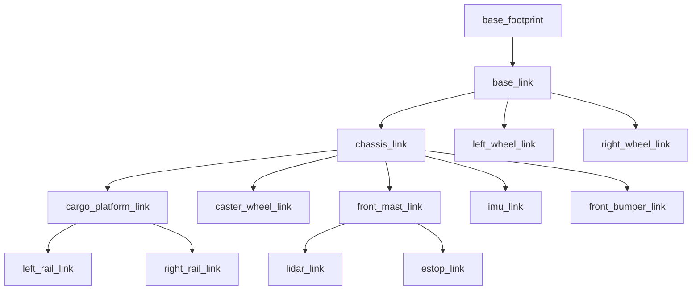

# Package ROS 2 `industry_robot` — Walkthrough complet

## Vue d'ensemble

Package ROS 2 Jazzy complet pour un robot mobile autonome (AMR) d'entrepôt, simulé sous Gazebo Harmonic. Design inspiré du TurtleBot3 Waffle et du robot industriel Effidence EffiBOT.

---

## Structure finale du package

```
industry_robot/
├── CMakeLists.txt                      # Build system avec install()
├── package.xml                         # Manifeste avec toutes les dépendances
├── urdf/
│   ├── warehouse_bot.urdf.xacro        # Fichier principal (inclusions)
│   ├── inertial_macros.xacro           # Macros d'inertie (box, cylinder, sphere)
│   ├── robot_core.xacro                # Corps du robot (châssis, roues, plateau...)
│   ├── lidar.xacro                     # Capteur LiDAR 2D (gpu_lidar)
│   ├── imu.xacro                       # Centrale inertielle
│   └── gazebo_control.xacro            # Plugins DiffDrive + JointStatePublisher
├── launch/
│   ├── sim.launch.py                   # Simulation monde vide
│   ├── sim_warehouse.launch.py         # Simulation monde entrepôt
│   └── display.launch.py              # Visualisation URDF seule (RViz)
├── config/
│   └── bridge.yaml                     # Mapping topics Gazebo ↔ ROS 2
├── rviz/
│   └── view_robot.rviz                # Config RViz (robot, TF, scan, odom)
└── worlds/
    └── warehouse.sdf                   # Monde entrepôt (murs, étagères, cartons)
```

---

## Corrections et améliorations apportées

### Bugs corrigés

| Problème | Avant | Après |
|----------|-------|-------|
| Nom du package dans les launch files | `warehouse_bot` | `industry_robot` |
| CMakeLists.txt manquait `install(DIRECTORY)` | Aucun install | 5 répertoires installés |
| package.xml manquait des dépendances | `urdf`, `xacro` seulement | + `ros_gz_sim`, `ros_gz_bridge`, `rviz2`, etc. |
| Châssis 60×40×20 cm (trop grand) | 0.6×0.4×0.2 m | **0.35×0.30×0.12 m** |
| Roues rayon 10 cm (trop grandes) | r=0.10 m | **r=0.065 m** |
| Caster rayon 5 cm (trop grand) | r=0.05 m | **r=0.025 m** |
| Masse totale ~20 kg | 15 + 1.5×2 + ... | **~5 kg** (budget réaliste) |
| LiDAR range min=0.15 m | 0.15 m | **0.12 m** |
| LiDAR range max=12 m | 12 m | **10 m** |
| IMU dimensions 4×4 cm | 0.04×0.04 m | **0.03×0.03 m** |
| base_joint z=0 (robot dans le sol) | z=0 fixe | **z=wheel_radius** (xacro property) |
| Spawn z=0.15 (robot flottant) | z=0.15 | **z=0.0** |
| Wheel separation incohérent | 0.44 m | **0.33 m** (= 2×0.165) |
| RViz Fixed Frame = base_footprint | Pas d'odom | **odom** (pour simulation) |

### Améliorations inspirées d'Effidence

| Élément ajouté | Description |
|----------------|-------------|
| **4 piliers de support** | Montants reliant châssis → plateau cargo |
| **Pare-chocs avant** | Barre de protection industrielle à l'avant |
| **Phares LED** | 2 petites lumières jaunes sur le mât avant |
| **Voyant LED status** | Indicateur vert d'opération sur le mât |
| **Bouton E-Stop** | Arrêt d'urgence rouge (visuel décoratif) |
| **Rails latéraux** | Garde-corps sur le plateau cargo |
| **Monde entrepôt** | `warehouse.sdf` avec murs, étagères, palettes de cartons |
| **Launch entrepôt** | `sim_warehouse.launch.py` pour tester en contexte réel |

### Dimensions utilisant des properties Xacro

Toutes les dimensions clés sont définies comme `<xacro:property>` en haut de `robot_core.xacro`, ce qui permet de les modifier facilement sans chercher dans tout le fichier.

---

## Hiérarchie TF



---

## Budget des masses (~5 kg)

| Composant | Masse (kg) |
|-----------|------------|
| Châssis | 3.00 |
| Plateau cargo | 0.30 |
| Roue gauche | 0.25 |
| Roue droite | 0.25 |
| Caster | 0.10 |
| Mât avant | 0.30 |
| LiDAR | 0.12 |
| Pare-chocs | 0.10 |
| 4 piliers (×0.03) | 0.12 |
| 2 rails (×0.06) | 0.12 |
| IMU | 0.02 |
| **Total** | **~4.68 kg** |

---

## Topics bridgés (Gazebo ↔ ROS 2)

| Topic | Type ROS 2 | Direction |
|-------|-----------|-----------|
| `/cmd_vel` | `Twist` | ROS → GZ |
| `/odom` | `Odometry` | GZ → ROS |
| `/tf` | `TFMessage` | GZ → ROS |
| `/joint_states` | `JointState` | GZ → ROS |
| `/scan` | `LaserScan` | GZ → ROS |
| `/imu` | `Imu` | GZ → ROS |
| `/clock` | `Clock` | GZ → ROS |
